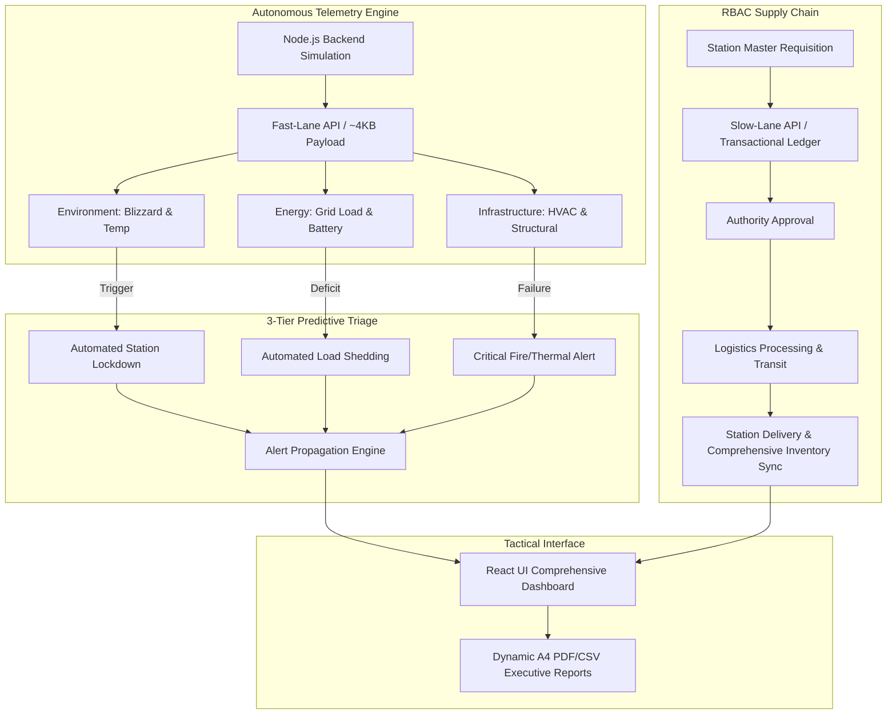

<h1 align="center">🧊 NCPOR Polar Twin: Antarctic Operations Command</h1>

<h3 align="center">Comprehensive Digital Twin Simulation & Logistics Intelligence</h3>
<br>
<div align="center">

  <!-- Hackathon Meta Badges -->
  <a href="https://sih.gov.in"></a>
  <a href="https://github.com/BPPIMTSIH26"></a>
  <a href="https://github.com/BPPIMTSIH26"></a>
  <a href="https://github.com/BPPIMTSIH26/SIH26060"></a>

  <!-- Technology Stack Badges -->
  <a href="#"></a>
  <a href="#"></a>
  <a href="#"></a>
  <a href="#"></a>
  <a href="#"></a>
  <a href="#"></a>

</div>

**Polar Twin** is a comprehensive full-stack digital twin simulation engine designed to model interdependent telemetry and supply chain workflows for India's extreme-environment research stations in Antarctica: **Maitri** and **Bharati**.

This system provides real-time monitoring, predictive alert logic, and role-based logistics management to ensure zero-latency operational oversight for the **National Centre for Polar and Ocean Research (NCPOR)**.

<div align="center">
<!-- Quick Action Links -->
  <a href="https://ncporpolartwin.vercel.app"></a>
  <a href="https://ncporpolartwin.vercel.app"></a>
</div>
<br>

<div align="center">

> **Smart India Hackathon (SIH 2026) | Problem Statement ID: 26060**  
> **Institution:** B.P. Poddar Institute of Management & Technology (**BPPIMT**)  
> **Lead Architect & Full-Stack Engineer:** **[Sayantan Pachal](https://github.com/sayantan-pachal)**
</div>

---

## 📌 Problem Statement Overview (SIH 26060)

| Attribute | Specification Details |
| :--- | :--- |
| **Problem Statement ID** | **26060** |
| **Problem Statement Title** | **Digital Twin Simulation Engine for Interdependent Antarctic Station Operations** |
| **Category** | Software / Remote Monitoring / Operational Intelligence |
| **Domain Bucket** | Smart Automation / Disaster Management / Earth & Polar Sciences |
| **Target End-Users** | NCPOR Command, Station Masters, Logistics Planners, Higher Authority |
| **Core Innovation** | Ultra-Low Bandwidth Telemetry (~4KB JSON) + 3-Tier Predictive Alerts + Multi-Stage RBAC Logistics + Dynamic Report Generation |

### The Real-World Challenge

Managing India's extreme-environment research stations (Maitri and Bharati) in Antarctica presents unprecedented logistical and operational bottlenecks:

1. **Constrained Satellite Bandwidth:** Transmitting high-frequency operational data from the South Pole risks severe latency, packet loss, and network saturation over limited satellite uplinks.
2. **Severe Environmental Hazards:** Lethal temperature drops and blinding blizzards require instantaneous detection to initiate automated lockdown protocols and protect both personnel and infrastructure.
3. **Cascading Subsystem Failures:** A localized power deficit directly impacts life-support thermal management, while incoming weather delays critical logistics. Traditional, isolated dashboards fail to map these cause-and-effect relationships.
4. **High-Stakes Supply Chain Fragmentation:** Managing life-critical supplies (fuel, medical, rations) across continents demands a fault-tolerant, multi-stage authorization workflow from initial requisition to on-station delivery.
5. **Hardware Isolation & Testing Latency:** Developers and planners lack physical access to classified remote sensor arrays, necessitating a high-fidelity software simulation environment to safely test disaster response protocols.
6. **Reporting & Oversight Delays:** Higher authorities at NCPOR command require immediate, structured situational awareness, but compiling data across fragmented systems leads to dangerous intelligence delays.

## 💡 The POLAR TWIN Solution

**Polar Twin** is an end-to-end full-stack digital twin simulation engine designed to model, monitor, and autonomously triage interdependent telemetry and supply chain workflows, ensuring zero-latency oversight for the **National Centre for Polar and Ocean Research (NCPOR)**.



## ⚙️ Core System Capabilities

### 1. 📡 Ultra-Low Bandwidth Telemetry Engine

- Operates independently via a custom Node.js backend generation engine, realistically simulating ambient temperature fluctuations, generator loads, and fuel burn rates.
- **Extreme Data Optimization:** Compresses the entire interdependent state of the station (Energy, Environment, Infrastructure) into a microscopic **~4KB JSON payload**, ensuring zero-latency updates over severely constrained Antarctic networks.

### 2. 🚨 3-Tier Predictive Alert System

- **Autonomous Triage:** Continuously parses telemetry streams to classify anomalies into a strict, globally visible 3-stage matrix (Nominal, Warning, Critical).
- **Event-Driven Mitigation:** Detects rapid temperature drops and high winds to immediately trigger cross-system blizzard lockdowns and automatic load shedding before catastrophic failure occurs.

### 3. ⚡ Interdependent Grid & Infrastructure Health

- **Live Net Power Mapping:** Continuously calculates total generation against station load, deploying autonomous battery depletion logic and estimated time-to-empty calculations.
- **Structural Diagnostics:** Tracks HVAC efficiency, fire suppression readiness, and module-specific internal climates (e.g., Main Lab vs. Living Quarters).

### 4. 📦 State-Machine Logistics & Supply Workflow

- **End-to-End Tracking:** Enforces a rigid lifecycle for all critical resources: *Requested → Authority Approved → Processing → In Transit → Delivered.*
- **Telemetry Syncing:** Prevents resource depletion by intelligently syncing projected delivery ETAs with the live inventory burn-rate engine.

### 5. 🛡️ Military-Grade Access Control (RBAC)

- **Role-Based Geofencing:** Strictly segregated privileges restrict Station Masters to their assigned base, while granting Logistics and Authority roles cross-station oversight.
- **Zero-Trust Security:** Secured via HTTP-only JWTs, robust session management, and SMTP-based OTP verification for high-clearance account creation and recovery.

### 6. 📊 Dynamic Executive Reporting Engine

- **On-Demand Intelligence:** Compiles targeted historical data (Energy, Environment, Logistics, or Overall) on the fly based on the user's domain scope and time window.
- **Client-Side Export Processing:** Features an advanced `@react-pdf/renderer` engine to dynamically generate structured A4 PDFs and CSV tables for immediate off-station executive briefings without overloading the server.

## 🖥️ System Architecture & UI Tour

<div align="center">

| Module | Route / Component | Description |
| :--- | :--- | :--- |
| **Tactical Dashboard** | `/dashboard` (`Dashboard.jsx`) | Real-time health scores, active blizzards, grid deficits, and priority alerts. |
| **Requisitions Command** | `/requisitions` (`Requisitions.jsx`) | RBAC supply chain queues, multi-stage approval pipelines, and direct inventory tracking. |
| **Data Export Engine** | `/reports` (`Reports.jsx`) | Configurable reporting matrix generating `@react-pdf/renderer` A4 dossiers and CSV tables. |
| **Energy Matrix** | `/energy` (`Energy.jsx`) | Deep-dive telemetry for diesel generators, active loads, and battery arrays. |
| **Environment Grid** | `/environment` (`Environment.jsx`) | Meteorological monitoring, thermal mapping, and atmospheric blizzard diagnostics. |
| **Infrastructure Health** | `/infrastructure` (`Infrastructure.jsx`) | Structural diagnostics, module-specific climates, and HVAC ventilation status. |
| **System Auth** | `/auth` (`Auth.jsx`) | Secured gateway featuring SMTP OTP dispatch and strict JWT session validation. |

</div>

## 🛠️ Technology Stack

```text
SIH26060/
├── backend/                 # Node.js + Express Simulation & API Server
│   ├── config/              # Environment and database configurations
│   ├── controllers/         # Telemetry generation, Auth logic, Report formatting
│   ├── middleware/          # JWT authentication and request validation
│   ├── models/              # Mongoose schemas (User, History, Logs)
│   ├── routes/              # Secured REST API endpoints
│   ├── simulation/          # The core algorithmic event-bus engine
│   ├── uploads/             # Static file storage for generated assets
│   ├── utils/               # Helper functions and formatters
│   ├── package.json         # Root unified dependencies
│   └── server.js            # Main application entry point
├── frontend/                # React + Vite + Tailwind CSS v3
│   ├── public/              # Static public assets
│   ├── src/                 # React source code
│   │   ├── assets/          # Images, SVGs, and global styles
│   │   ├── components/      # Frost-glass UI cards, Custom Dropdowns, Navbars
│   │   ├── pages/           # Departmental dashboard views
│   │   ├── services/        # Unified API service adapters (Axios)
│   │   ├── Layout.jsx       # Global application layout wrapper
│   │   ├── main.jsx         # React DOM entry point
│   │   └── scrollAnimation.js # Global intersection observer logic
│   ├── index.html           # Main HTML template
│   ├── vercel.json          # Vercel deployment routing configuration
│   ├── package.json         # Root unified dependencies
│   └── vite.config.js       # Vite bundler configuration
└── README.md                # System documentation & technical specification

```

### 💻 Core Technologies

- **Frontend**: React.js, Vite, Tailwind CSS v3, Lucide Icons, `@react-pdf/renderer` (for on-the-fly programmatic document generation).
- **Backend & Security**: Node.js, Express.js, JWT (HTTP-Only session management), bcrypt (cryptographic password hashing), Google Apps Script (SMTP OTP dispatch).
- **Database & State**: MongoDB Atlas, Mongoose ODM, React Context API.
- **Architecture**: Event-Driven Simulation Engine, strict REST API segregation (Fast-Lane vs. Slow-Lane).
- **DevOps & Tools**: Vercel (Frontend Edge Deployment), Render (Backend Deployment), Postman (API Documentation & Testing), npm.

## 🚀 Quick Start Guide

### Prerequisites

- **Node.js** (v18.0 or higher)
- **MongoDB Atlas** Cluster (or local instance)
- **Git**

### Step-by-Step Manual Setup

**1. Backend Service (Node + Express)**

```
cd backend

# Install dependencies
npm install

# Configure environment variables
# Create a .env file based on .env.example (MONGO_URI, JWT_SECRET, SMTP_PASS, etc.)
cp .env.example .env

# Launch the Simulation API Server
npm run dev

```

- **Backend API**: <http://localhost:5000/api>

**2. Frontend Application (React + Vite)**

```
cd frontend

# Install packages
npm install

# Configure environment variables
# Set VITE_API_BASE_URL to http://localhost:5000/api
cp .env.example .env

# Launch Vite development server
npm run dev
```

- **Frontend Application**: <http://localhost:5173>

## 🛡️ Personnel Access Governance & Clearance Tiers

| Role | Operational Capabilities & Clearance Limitations |
| :--- | :--- |
| **Authority** | Ultimate oversight. Can approve high-priority logistics requisitions and view telemetry for both Maitri and Bharati` |
| **Logistics** | Fleet and supply chain management. Can process approved orders and update transit statuses across both stations. |
| **Station Master** | Locked to assigned station. Can submit requisitions, view local telemetry, and execute local reporting. Cannot view cross-station data. |

> **Security & Authentication Protocol**: Direct plaintext passwords are strictly prohibited. Sessions are validated dynamically. Registration requires real-time SMTP Gmail OTP verification to ensure only official NCPOR personnel gain system access.

## 📡 REST API Reference

The Polar Twin backend is strictly segregated into rapid telemetry streams ("Fast Lane") and standard transactional operations ("Slow Lane") to ensure zero latency during critical alerts. All secure routes require `HTTP-Only` JWTs and strict RBAC authorization.

### 🔐 Authentication & Security (`/api/auth`)
| Method | Endpoint | Description |
| :--- | :--- | :--- |
| `POST` | `/api/auth/login` | Authenticate operator and issue secure HTTP-only JWT |
| `POST` | `/api/auth/send-registration-otp` | Dispatch 6-digit email verification code via SMTP |
| `POST` | `/api/auth/register` | Register new personnel with OTP verification & avatar upload |
| `PUT` | `/api/auth/update-password` | Securely update operator credentials |

### ⚡ Telemetry Simulation - Fast Lane (`/api/telemetry`)
| Method | Endpoint | Description |
| :--- | :--- | :--- |
| `GET` | `/api/telemetry/{stationId}/live` | Retrieve full live simulated data (Energy, Env, Infra) |
| `GET` | `/api/telemetry/{stationId}/{section}/live` | Fetch isolated live metrics for a specific subsystem |

### 📦 Logistics & Requisitions - Slow Lane (`/api/orders` & `/api/logistics`)
| Method | Endpoint | Description |
| :--- | :--- | :--- |
| `GET` | `/api/logistics/{stationId}/data` | Fetch comprehensive station inventory ledgers and stock levels |
| `GET` | `/api/orders/{stationId}` | Query all active and historical supply requisitions |
| `POST` | `/api/orders/{stationId}/create` | Submit a formal supply requisition (Station Master) |
| `PUT` | `/api/orders/{stationId}/{orderId}/review` | Authority RBAC workflow to approve or reject requisitions |
| `PUT` | `/api/orders/{stationId}/{orderId}/deliver` | Update shipment transit status and finalize station delivery |
| `POST` | `/api/orders/{stationId}/direct-entry` | Direct inventory modification (bypass) for Logistics Operators |

### 📊 Executive Reporting (`/api/reports`)
| Method | Endpoint | Description |
| :--- | :--- | :--- |
| `GET` | `/api/reports/{stationId}?report_type=x` | Compile historical operational data for A4 PDF and CSV exports |

## 👥 Hackathon Team & Acknowledgements

- **Team Name**: **ORION**
- **Organization**: **BPPIMTSIH26** (B.P. Poddar Institute of Management and Technology)
- **Smart India Hackathon 2026**: Problem Statement **26060**
- **Project Title**: NCPOR Polar Twin Command

### Team Structure & Contributions

#### 🌟 Core Project Leadership

- 👑 **Sayantan Pachal** ([@sayantan-pachal](https://github.com/sayantan-pachal)) - **Lead Architect, Full-Stack Developer & Simulation Engine Creator**
- ⚙️ **Shivam Gupta** ([@shiv2345king](https://github.com/shiv2345king)) - **Backend Infrastructure & Database Optimization Engineer**
- 🔍 **Shougata Sikder** ([@Shougata2003](https://github.com/Shougata2003)) - **Product Testing & Quality Assurance Lead**

#### ⚓ Engineering & Domain Specialists

- 🧮 **Ishika Chowdhury** ([@i5hika0x](https://github.com/i5hika0x)) - **Algorithmic Simulation & Event-Driven Systems Specialist**
- 🖥️ **Narayan Kumar Jha** ([@narayan-nkj](https://github.com/narayan-nkj)) - **Frontend Architecture & UI/UX Design Specialist**
- 📊 **Ahana** ([@I-Lawrence](https://github.com/I-Lawrence)) - **Telemetry Processing & Automated Reporting Specialist**

<br>

---

<div align="center">
  <p>
    <sub>Engineered with precision for Smart India Hackathon 2026. <b>NCPOR Polar Twin Command by ORION</b>.</sub><br />
    <sub>Documented by Sayantan Pachal</sub>
  </p>
</div>
