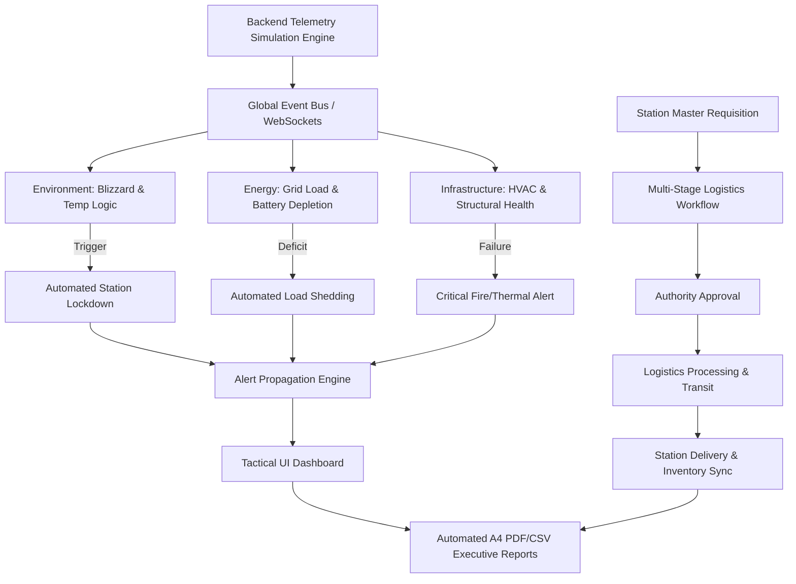

<h1 align="center">🧊 NCPOR Polar Twin: Antarctic Operations Command</h1>

<h3 align="center">Comprehensive Digital Twin Simulation & Logistics Intelligence</h3>
<br>
<div align="center">

  <!-- Hackathon Meta Badges -->
  <a href="https://sih.gov.in"></a>
  <a href="https://github.com/BPPIMTSIH26"></a>
  <a href="https://github.com/BPPIMTSIH26/SIH26060"></a>

  <!-- Technology Stack Badges -->
  <a href="#"></a>
  <a href="#"></a>
  <a href="#"></a>
  <a href="#"></a>
  <a href="#"></a>
  <a href="#"></a>

</div>

**Polar Twin** is a comprehensive full-stack digital twin simulation engine designed to model interdependent telemetry and supply chain workflows for India's extreme-environment research stations in Antarctica: **Maitri** and **Bharati**.

This system provides real-time monitoring, predictive alert logic, and role-based logistics management to ensure zero-latency operational oversight for the **National Centre for Polar and Ocean Research (NCPOR)**.

<div align="center">
<!-- Quick Action Links -->
  <a href="https://ncporpolartwin.vercel.app"></a>
  <a href="https://ncporpolartwin.vercel.app"></a>
</div>
<br>

<div align="center">

> **Smart India Hackathon (SIH 2026) | Problem Statement ID: 26060**  
> **Institution:** B.P. Poddar Institute of Management & Technology (**BPPIMTSIH26**)  
> **Lead Architect & Full-Stack Engineer:** **[Sayantan Pachal](https://github.com/sayantan-pachal)**
</div>

---

## 📌 Problem Statement Overview (SIH 26060)

| Attribute | Specification Details |
| :--- | :--- |
| **Problem Statement ID** | **26060** |
| **Problem Statement Title** | **Digital Twin Simulation Engine for Interdependent Antarctic Station Operations** |
| **Category** | Software / Remote Monitoring / Operational Intelligence |
| **Domain Bucket** | Smart Automation / Disaster Management / Earth & Polar Sciences |
| **Target End-Users** | NCPOR Command, Station Masters, Logistics Planners, Higher Authority |
| **Core Innovation** | Real-Time Telemetry Simulation + Global Event-Driven Alerts + Multi-Stage RBAC Logistics |

### The Real-World Challenge

Managing India's extreme-environment research stations (Maitri and Bharati) in Antarctica presents unprecedented logistical and operational challenges:

1. **Severe Environmental Hazards**: Lethal temperature drops, blinding blizzards, and gale-force winds require instantaneous lockdown protocols to protect personnel and infrastructure.
2. **Hardware Disconnection & Testing Bottlenecks**: Developers and planners lack physical access to classified or remote sensor hardware, necessitating a high-fidelity simulation environment to test response protocols.
3. **Fragmented Supply Chains**: Managing critical supplies (fuel, medical, rations) across continents requires an infallible, multi-stage approval workflow from requisition to on-station delivery.
4. **Interdependent Subsystem Failures**: A power deficit directly impacts thermal management; a blizzard delays logistics. Traditional isolated dashboards fail to map these cascading cause-and-effect relationships.

## 💡 The POLAR TWIN Solution

**Polar Twin** is an end-to-end full-stack digital twin simulation engine designed to model, monitor, and autonomously triage interdependent telemetry and supply chain workflows, ensuring zero-latency oversight for the **National Centre for Polar and Ocean Research (NCPOR)**.



## 🌟 The Five Pillars of Intelligence

### 1. 📡 Real-Time Telemetry Simulation Engine

- Operates entirely independently of physical hardware via a custom Node.js backend generation engine.
- **Simulates realistic operational parameters**: ambient temperature fluctuations, wind speeds, generator loads, and fuel burn rates.
- Pushes live updates directly to the React frontend, behaving identically to a true field-deployed sensor array.

### 2. ⚡ Interdependent Energy & Power Grid

- **Live Net Power Mapping**: Continuously calculates total generation against station load.
- **Battery Depletion Logic**: Autonomously triggers estimated time-to-empty calculations when generation drops below load.
- **Fuel Reserves**: Real-time percentage tracking and days-remaining projections based on current consumption.

### 3. ❄️ Environmental Defense & Infrastructure Health

- Monitors exterior phenomena (visibility, gale warnings) and internal conditions (module temperatures).
- **Automated Blizzard Protocols**: Detects rapid temperature drops and high winds to trigger cross-system lockdown alerts.
- Tracks HVAC efficiency, fire suppression readiness, and module-specific structural integrity.

### 4. 📦 Full-Scale Logistics & Supply Chain Workflow

- Complete lifecycle management from local station requisition to final delivery.
- Implements a rigid state-machine workflow: Requested → Authority Approved → Processing → In Transit → Delivered.
- Prevents critical resource depletion by syncing incoming shipments directly with the live telemetry engine.

### 5. 🛡️ Military-Grade Access Control (RBAC)

- **Station Masters**: Geofenced to their assigned Antarctic station (Maitri or Bharati).
- **Logistics & Authority Users**: Cross-station oversight capabilities with elevated approval privileges.
- Secured via strict JWT HTTP-only cookies, robust session management, and Gmail-based OTP verification for high-clearance account creation and recovery.

## 🖥️ System Architecture & UI Tour

<div align="center">

| Module | Route / Component | Description |
| :--- | :--- | :--- |
| **Tactical Dashboard** | `/dashboard` (`Dashboard.jsx`) | Real-time health scores, active blizzards, grid deficits, and priority alerts. |
| **Data Export Engine** | `/reports` (`Reports.jsx`) | Configurable reporting matrix generating @react-pdf/renderer A4 dossiers and CSV tables. |
| **Logistics Command** | `/logistics` (`Logistics.jsx`) | Requisition queues, multi-stage approval pipelines, and inventory tracking. |
| **Energy Matrix** | `/energy` (`Energy.jsx`) | Deep-dive telemetry for diesel generators, active loads, and battery arrays. |
| **Environment Grid** | `/environment` (`Environment.jsx`) | Meteorological monitoring, thermal mapping, and atmospheric diagnostics. |
| **System Auth** | `/auth` (`Auth.tsx`) | Secured gateway featuring OTP dispatch and strict token-based session validation. |

</div>

## 🛠️ Technology Stack

```
SIH26060-PolarTwin/
├── backend/                 # Node.js + Express Simulation & API Server
│   ├── controllers/         # Telemetry generation, Auth logic, Report formatting
│   ├── models/              # Mongoose schemas (User, History, Logs)
│   ├── simulation/          # The core algorithmic event-bus engine
│   └── routes/              # Secured REST API endpoints
├── frontend/                # React + Vite + Tailwind CSS v3
│   ├── src/components/      # Frost-glass UI cards, Custom Dropdowns, Navbars
│   ├── src/pages/           # Departmental dashboard views
│   └── src/api/             # Unified service adapters and configuration hooks
├── package.json             # Root unified dependencies
└── README.md                # System documentation & technical specification
```

### Core Technologies

- **Frontend**: React, Vite, Tailwind CSS, Lucide React, @react-pdf/renderer (for on-the-fly programmatic document generation).
- **Backend API**: Node.js, Express.js, JWT, AppScript(OTP).
- **Database & State**: MongoDB Atlas, Mongoose ODM, React Context API.
- **Architecture**: Global Event Bus for simulated sensor-to-alert propagation.
- **DevOps & Deployment**: Vercel (Client Edge Deployment), Render (Server Deployment).

## 🚀 Quick Start Guide

### Prerequisites

- **Node.js** (v18.0 or higher)
- **MongoDB Atlas** Cluster (or local instance)
- **Git**

### Step-by-Step Manual Setup

**1. Backend Service (Node + Express)**

```
cd backend

# Install dependencies
npm install

# Configure environment variables
# Create a .env file based on .env.example (MONGO_URI, JWT_SECRET, SMTP_PASS, etc.)
cp .env.example .env

# Launch the Simulation API Server
npm run dev

```

- **Backend API**: <http://localhost:5000/api>

**2. Frontend Application (React + Vite)**

```
cd frontend

# Install packages
npm install

# Configure environment variables
# Set VITE_API_BASE_URL to http://localhost:5000/api
cp .env.example .env

# Launch Vite development server
npm run dev
```

- **Frontend Application**: <http://localhost:5173>

## 🛡️ Personnel Access Governance & Clearance Tiers

| Role | Operational Capabilities & Clearance Limitations |
| :--- | :--- |
| **Authority** | Ultimate oversight. Can approve high-priority logistics requisitions and view telemetry for both Maitri and Bharati` |
| **Logistics** | Fleet and supply chain management. Can process approved orders and update transit statuses across both stations. |
| **Station Master** | Locked to assigned station. Can submit requisitions, view local telemetry, and execute local reporting. Cannot view cross-station data. |

> **Security & Authentication Protocol**: Direct plaintext passwords are strictly prohibited. Sessions are validated dynamically. Registration requires real-time SMTP Gmail OTP verification to ensure only official NCPOR personnel gain system access.

## 📡 REST API Reference

| Method | Endpoint | Description |
| :--- | :--- | :--- |
| `POST` | `/api/users/login` | Authenticate operator and issue secure HTTP-only JWT |
| `POST` | `/api/users/send-registration-otp` | Dispatch 6-digit verification code via SMTP |
| `GET` | `/api/telemetry/{stationId}/live` | Retrieve live simulated operational data (Energy/Env/Infra) |
| `GET` | `/api/reports/{stationId}` | Fetch comprehensive historical data for PDF/CSV generation |
| `GET` | `/api/logistics/{stationId}` | Query active supply chains and local inventory ledgers |
| `PATCH` | `/api/logistics/update-status` | Progress a shipment through the RBAC approval pipeline |

## 👥 Hackathon Team & Acknowledgements

- **Team Name**: **ORION**
- **Organization**: **BPPIMTSIH26** (B.P. Poddar Institute of Management and Technology)
- **Smart India Hackathon 2026**: Problem Statement **26060**
- **Project Title**: NCPOR Polar Twin Command

### Team Structure & Contributions

#### 🌟 Core Project Leadership

- 👑 **Sayantan Pachal** ([@sayantan-pachal](https://github.com/sayantan-pachal)) - **Lead Architect, Full-Stack Developer & Simulation Engine Creator**
- ⚙️ **Shivam Gupta** ([@shiv2345king](https://github.com/shiv2345king)) - **Backend Infrastructure & Database Optimization Engineer**
- 🔍 **Shougata Sikder** ([@Shougata2003](https://github.com/Shougata2003)) - **Product Testing & Quality Assurance Lead**

#### ⚓ Engineering & Domain Specialists

- 🧮 **Ishika Chowdhury** ([@i5hika0x](https://github.com/i5hika0x)) - **Algorithmic Simulation & Event-Driven Systems Specialist**
- 🖥️ **Narayan Kumar Jha** ([@narayan-nkj](https://github.com/narayan-nkj)) - **Frontend Architecture & UI/UX Design Specialist**
- 📊 **Ahana** ([@I-Lawrence](https://github.com/I-Lawrence)) - **Telemetry Processing & Automated Reporting Specialist**

<br>
<br>

---

<div align="center">
  <p>
    <sub>Engineered with precision for Smart India Hackathon 2026. <b>NCPOR Polar Twin Command by ORION</b>.</sub><br />
    <sub>Documented by Sayantan Pachal</sub>
  </p>
</div>
