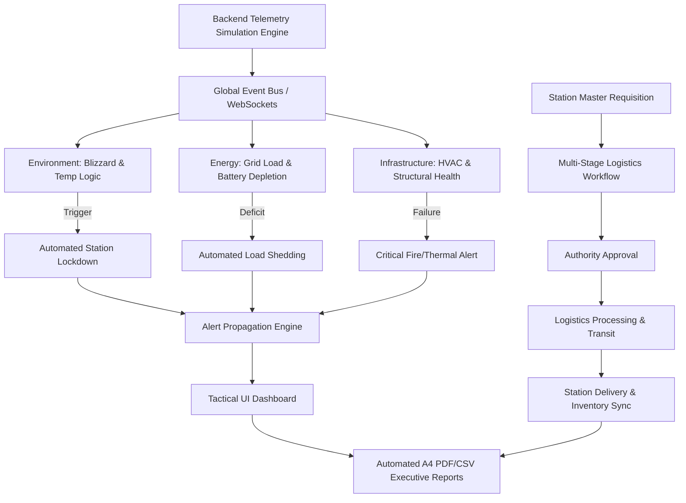

## 💡 The POLAR TWIN Solution

**Polar Twin** is an end-to-end full-stack digital twin simulation engine designed to model, monitor, and autonomously triage interdependent telemetry and supply chain workflows, ensuring zero-latency oversight for the **National Centre for Polar and Ocean Research (NCPOR)**.

